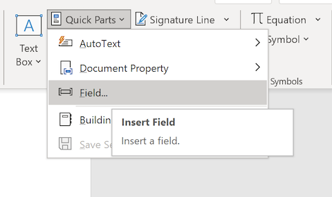
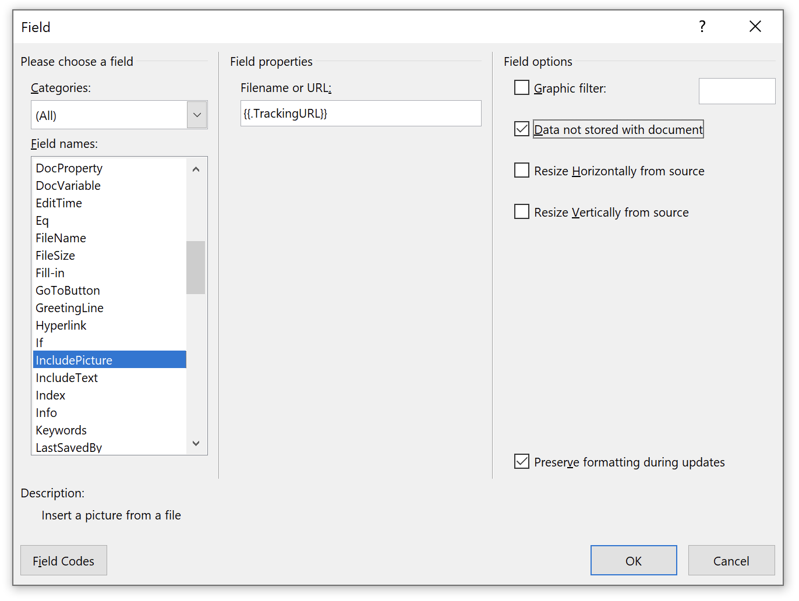
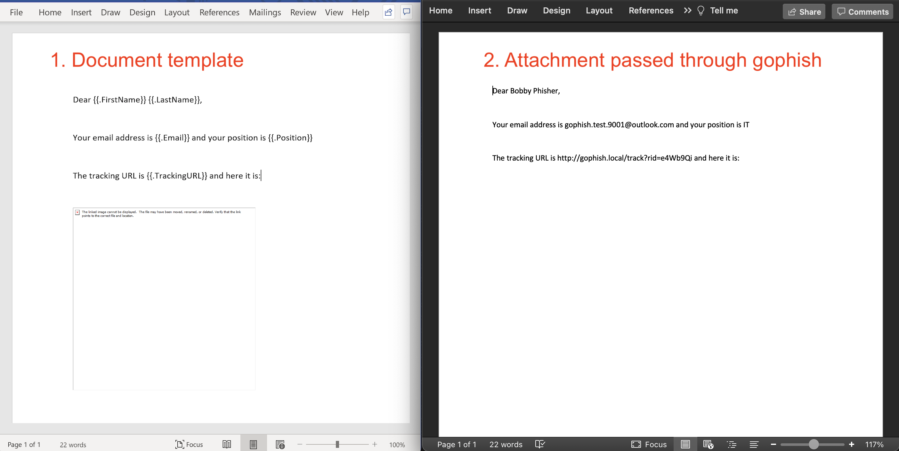

# Attachment Tracking

It is possible to add gophish [template variables](https://docs.getgophish.com/user-guide/template-reference) to the contents of certain attachment file types. The following file types are supported:

| Type          | Extension     | Sample Template     |
| ------------- |:-------------:| :-------------:|
| Word Document      | .docx | [gophish_word.docx](example-attachments/gophish_word.docx) |
| Word Macro Enabled Document| .docm|  [gophish_word_macro.docm](example-attachments/gophish_word_macro.docm) |
| PowerPoint Presentation | .pptx| [gophish_powerpoint.pptx](example-attachments/gophish_powerpoint.pptx) |
| Excel Document | .xlsx | [gophish_excel.xlsx](example-attachments/gophish_excel.xlsx) |
| Excel Macro Enabled Document | .xlsm | [gophish_excel_macro.xlsm](example-attachments/gophish_excel_macro.xlsm) |
| Plain Text File | .txt | [gophish_text.txt](example-attachments/gophish_text.txt) |
| HTML File | .html | [gophish_html.html](example-attachments/gophish_html.html) |
| Calendar File | .ics | [gophish_invite.ics](example-attachments/gophish_invite.ics) |    

Any template variables placed inside these documents will be converted to the appropriate values when a campaign is launched. Adding tracking images to Office documents can allow notification that a document has been opened or that macros have been enabled.

If you just want to get up and running, using the above templates is probably for you. Keep reading below if you're interested how these examples were created (specifically the Office documents which are more involved).

---

## Plain Text Examples
Below is a .txt file with several variables:

`foo.txt`
```
Hello {{.FirstName}},
This is a plain text file that was sent to {{.Email}}. If you could be so kind as to copy and paste this URL into your browser: {{.URL}}
```

As can be seen this is not immediately useful, but perhaps there are some scenarios where templating a plain text file is useful. Below is a portion of of an .ics calendar invitation file:

`invite.ics`
```
BEGIN:VCALENDAR
DTSTAMP:20210306T182251Z
DTSTART;TZID=Europe/London:20210306T183000
DTEND;TZID=Europe/London:20210306T190000
SUMMARY:Gophish Test Calendar
TZID:Europe/London
DESCRIPTION:Glenn  is inviting you to a Zoom meeting.
 n\nJoin Zoom Meeting\n{{.URL}}
LOCATION:{{.URL}}
END:VCALENDAR
```


## Office Document Examples
A more useful use case for this functionality is likely to be the tracking of Microsoft Office documents, specifically the conditions of (i) opening a document and (ii) enabling macros. Gophish supports several Office formats, but the approach is largely the same.

### Tracking Office document being Opened
We can add the `{{.TrackingURL}}` variable to an Office document as a "linked image". When the document is opened Word/Excel/PowerPoint will try load the image, thereby reaching out to the gophish server and marking the document as opened (ensure the Tracking URL is not included in the Email, as at this stage there is only one endpoint to indicated 'Opened'). The following steps can be used to achieve this:

1. Create a new Document
2. Select the `Insert` tab and then click `Quick Parts` and then `Field`



3. Scroll down on the left and select `IncludePicture`. In the Filename or URL input box enter `{{.TrackingURL}}` and tick the `Data not stored with document` box on the right (alternatively, in the Word Document press Alt+F9 to toggle Field Codes and paste in `INCLUDEPICTURE  "{{.TrackingURL}}" \d`):




4. If you want to include template variables (e.g `{{.FirstName}}`) in the body of the Word document you will need to disable grammar and spelling checking (otherwise Word inserts proofErrors in the middle of the variable names). Select File > Options > Proofing and deselect `Check spelling as you type` and `Mark grammar errors as you type`. 

The image below depicts the template Word file on the left, and the result after passing through gophish as a campaign attachment and being opened by a target user on the right.




### Tracking Office document Macro execution
To track if macros have been enabled by a user we need macro code that reaches out to a gophish Template Variable (e.g. `{{.TrackerURL}}`) or hits a gophish endpoint (e.g. `{{.URL}}`). Focusing on the latter option, we would want the macro code to reach out to, for example, https://myphishingserver.com/?rid=aBC12345. There are many different ways to handle this, but simply inserting some gophish variables into the macro code doesn't work, as it's non-trivial to programatically edit macro code (it's packaged up in a binary format). The solution we came up with was to insert a text box in the document with the variables, and reference that text box from the macro code. The steps involved are:

1. Create a new Document
2. Create a textbox with contents `{{.URL}}`
3. Name the textbox "`urlbox`" by selecting the textbox and following the instructions below:
  
  Windows: Home > Editing > Select > Selection Pane
  
  Mac: Shape Format > Arrange > Selection Pane 

4. Add the following macro code to the document (F11):

```
Sub urlfetch()
 Dim shp As Shape

 For Each shp In ActiveDocument.Shapes
    If shp.Name = "urlbox" Then
        URL = shp.TextFrame.TextRange.Text
        ActiveDocument.FollowHyperlink Address:=URL
    End If
 Next
End Sub

Public Sub AutoOpen()
    urlfetch
End Sub

```

or for Excel:
```
Sub urlfetch()
  For Each shp In ActiveSheet.Shapes
    If shp.Name = "urlbox" Then
        Url = shp.TextFrame2.TextRange.Text
        FollowHyperlink (Url)
    End If
  Next
End Sub

Public Sub Workbook_Open()
    urlfetch
End Sub
```

4. Save and Exit

When the document is opened the user will be prompted to enable macros. If they do, the `{{.URL}}` will be opened. This allows the user to be presented with a page informing them that they have fallen victim to a phishing campaign.
  
(Note: In the future it'd be neater to use the `Application.Documents.CanCheckOut (URL)` method, but this is a HEAD request which requires some modification of the gophish Link Clicked code)