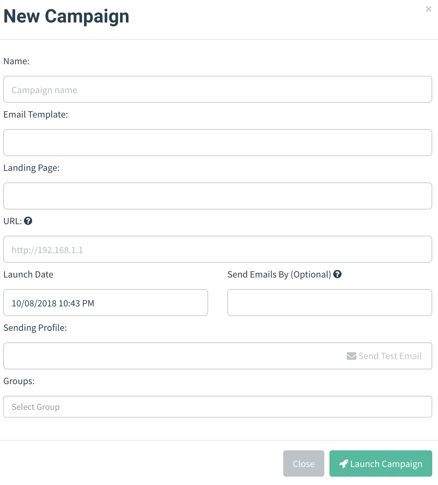
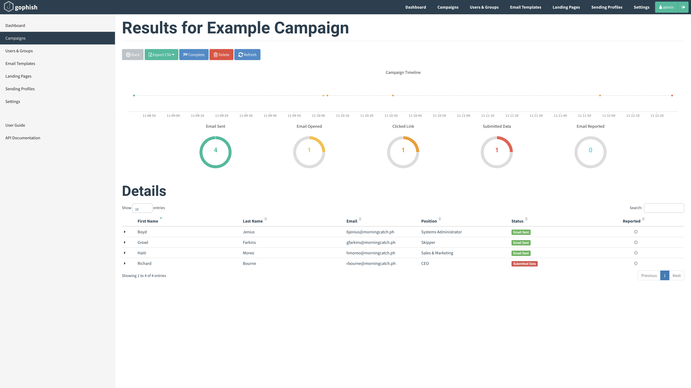
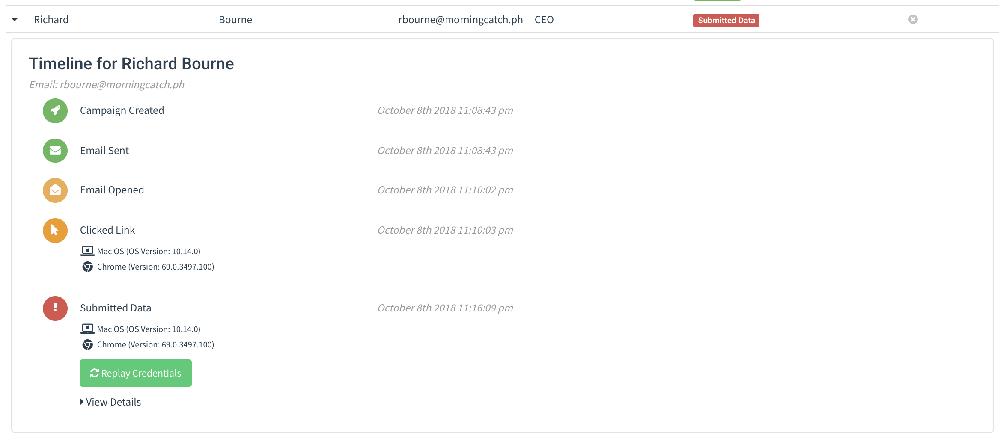

# Campaigns

Gophish is centered around launching campaigns. This involves sending emails to one or more groups and monitoring for opened emails, clicked links, or submitted credentials.

## Launching a Campaign

To configure and launch a campaign, click the "Campaigns" entry in the navigation sidebar.



Setting up a campaign requires the following fields to be provided:

* **Name** - The name of the campaign
* **Email Template** - The email that is sent to campaign recipients. This is created in the [Email Templates](templates.md) section of the documentation.
* **Landing Page** - The HTML that is returned when a recipient clicks the link in the email template. This is created in the [Landing Pages](landing-pages.md) section of the documentation.
* **URL** - This is the URL that populates the `{{.URL}}` template value, commonly used in email templates. This should be a URL or IP address that points to the Gophish phishing server and is reachable by the recipient.
* **Launch Date** - This is the date that the campaign will begin. See Scheduling Campaigns for more information.
* **Send Emails By** - This is the date all emails will be sent by. See Scheduling Campaigns for more information.
* **Sending Profile** - This is the SMTP configuration to use when sending emails. This is created in the [Sending Profiles](sending-profiles.md) section of the documentation.
* **Groups** - This defines which groups of recipients should be included in the campaign.

### Scheduling Campaigns

Gophish supports scheduling campaigns, making it easy to plan campaigns in advance. There are two fields to consider when scheduling campaigns: the **Launch Date** and the **Send Emails By** date.

The **Launch Date** is when Gophish should start sending emails. By default, Gophish assumes you want the campaign to be launched immediately.

Gophish also assumes that you want all emails to be sent immediately after the campaign is launched, and to be sent as quickly as possible. However, there are times where you may wish to spread the emails over a period of time. Setting the **Send Emails By** date tells Gophish to spread emails evenly between the launch date and this date. 

### Launching the Campaign

After you have the campaign configuration ready to go, click the "Launch Campaign" button, click through the confirmation message, and you're good to go! Depending on your scheduling settings, Gophish will either launch the campaign immediately or will schedule the campaign to be launched at a later date.

## Viewing Campaign Results

When a campaign is launched, you are automatically redirected to the campaign results screen:



On the results page, you will see overview information on the campaign status as well as detailed results for each target.

### Exporting Campaign Results

To export campaign results in CSV format, click the "Export CSV" format and select the type of results you want to export:

* **Results** - The current status for each target in the campaign.

  Contains the following fields:

  ```text
  id, email, first_name, last_name, position, status, ip, latitude, longitude
  ```

* **Raw Events** - Contains a stream of events as they occurred during the campaign.

### Completing a Campaign

To complete a campaign, click the "Complete" button and confirm that you want to mark the campaign as completed.

### Deleting a Campaign

To delete a campaign, click the "Delete" button and confirm that you want to delete the campaign.

> Note: This **cannot** be undone, so be careful when deleting a campaign!

### Viewing Result Details

Gophish makes it easy to view the campaign results in a timeline format.

To view the timeline for each recipient, expand the row with the recipient's name.



The results pane shows what a campaign recipient did, such as opening the email, clicking the link, or attempting to submit data from the landing page.

Gophish also records information about the device that clicked the link or submitted data. This data is parsed from the browser's user-agent string. The operating system and browser version is displayed below the event details.

#### Viewing Captured Credentials

If you selected the "Capture Credentials" option when building a landing page, Gophish displays the credentials in the results pane. To view them, click the "View Details" dropdown which renders the captured credentials in a table.

