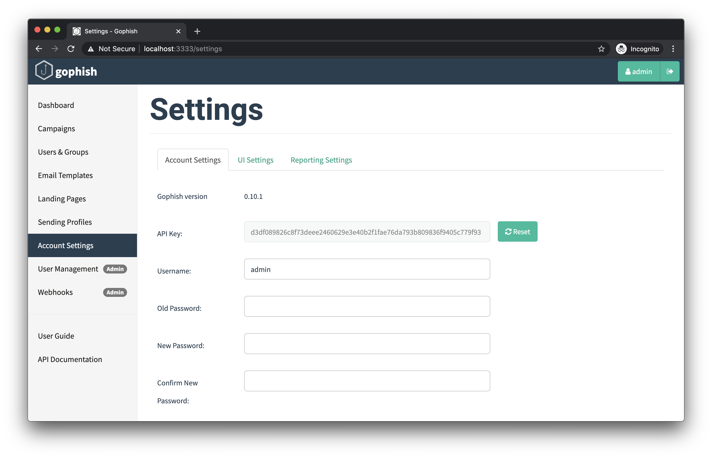

# Changing Account Settings

## Changing Your Password & Updating Settings

By clicking the "Settings" tab, you will navigate to the settings page. This page allows you to change your password, as well as update your API key.

To change your password, submit your current password, as well as the new password you would like to use, and click "Save". Any errors will be indicated on the page.

This page also provides the ability to reset your API key. To reset your API key, simply click the "Reset" button next to the existing API key.

You might need to refresh the page before continuing to use gophish. This should be fixed soon.

