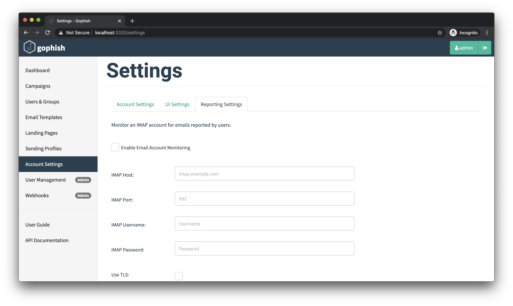
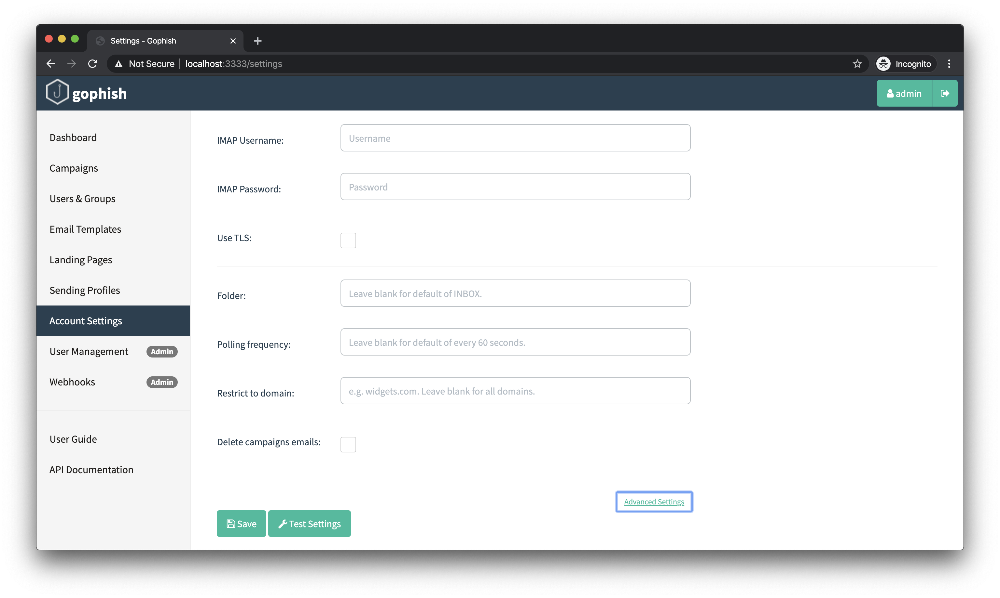

# Email Reporting

Gophish supports the ability for users to report the simulated phishing emails they receive. This is to encourage users to report suspicious to their administrators, potentially catching malicious emails earlier.

Right now, we only support this reporting feature on the **server side** of things. While we don't yet have actual email extensions and add ons that can be used to facilitate this reporting, as of v0.9.0 we do support email reporting via IMAP.

## The Importance of Email Reporting

When running phishing simulations, we often focus solely on how many users clicked the links and submitted their credentials to the spoofed page. However, I would argue that there's just as much if not more value in focusing on who reported the emails to their administrator.

Consider a simple scenario where we send out 100 simulated phishing emails. Let's look through two possible outcomes:

* **Outcome 1** - In this outcome, only 1 user clicks the link and submits credentials. That's great! However, no one reports the email. In this case, as an administrator our users were targeted by phishing and an attacker has a valid set of credentials, yet we don't know anything has happened.
* **Outcome 2** - In this outcome, 50 users click the link and only 1 user reports it. In this case sure, more users clicked the link, but as an administrator we now know that a phishing campaign is in progress and we can start the incident response process.

Reporting suspicious emails can help prevent the impact of a phishing campaign. It's recommended to build a culture that **rewards the users who report emails**. Even something small like an email to that employee and their manager thanking them for their vigilance can go a long way. This gives positive feedback that will encourage users to report more emails in the future.

## Reporting via IMAP

A common \(and good!\) practice for organizations is to create an email address such as security@example.com and encourage employees to forward any suspicious emails. This is a great way to work towards building a collaborative relationship between the employee and security team.

As of v0.9.0, Gophish has the ability to check a configured mailbox via IMAP for campaign emails that have been reported. Once a campaign email is found, that result is updated to show that the user reported the email.

Each Gophish user has the ability to configure their own IMAP settings. These settings are found under "Account Settings &gt; Reporting Settings".



The most common settings you'll need are the IMAP hostname, port, username, and password. It's commonly the case that you'll want to enable TLS but this is something you should confirm with your email provider.

### Advanced Settings

There is also a number of Advanced Settings that allow you to configure which folder campaign emails will be listed in or how often Gophish should poll for new results. Additionally, you can restrict it to only consider emails that have been reported from an address with your organizations domain name. Finally, Gophish can optionally delete campaign emails after they have been reported.



After IMAP settings have been configured, you can either save them or use the "Test Settings" button to confirm that Gophish can establish an IMAP connection.

## How Reporting Works in Gophish

Every email sent by Gophish contains a link pointing to the [Landing Page](landing-pages.md) configured for the campaign. This URL looks like this:

```text
http://phish_server/?rid=1234567
```

The `rid` parameter specifies which recipient this link was generated for. To report an email sent by Gophish, an HTTP request needs to be made to:

```text
http://phish_server/report?rid=1234567
```

Sending this HTTP request is usually handled by a mail client extension. As indicated earlier, we're still working on getting those developed. If you're interested in helping make this happen, please [open an issue on Github!](https://github.com/gophish/gophish/issues)

