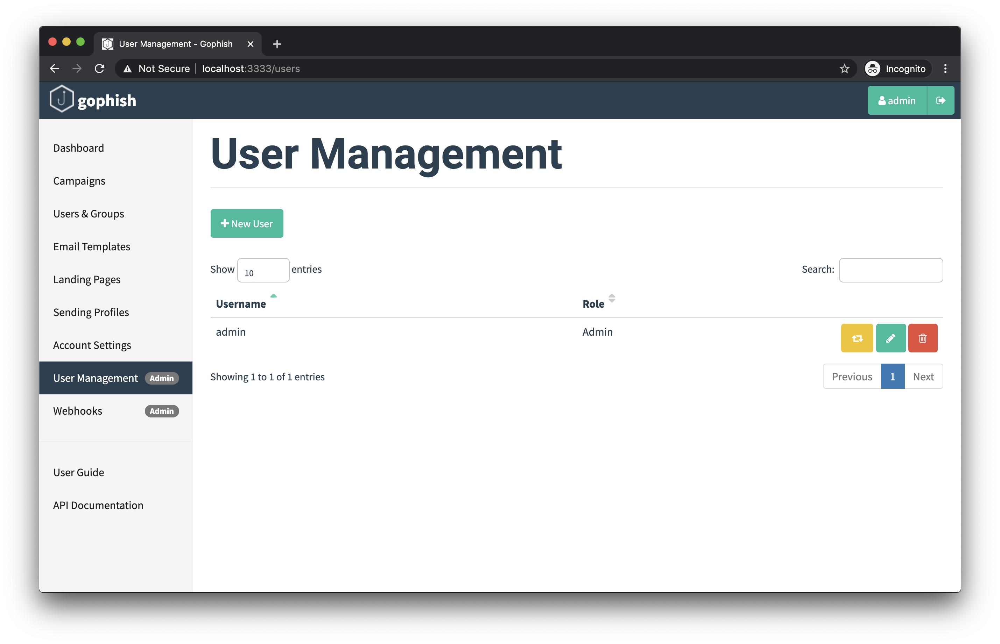
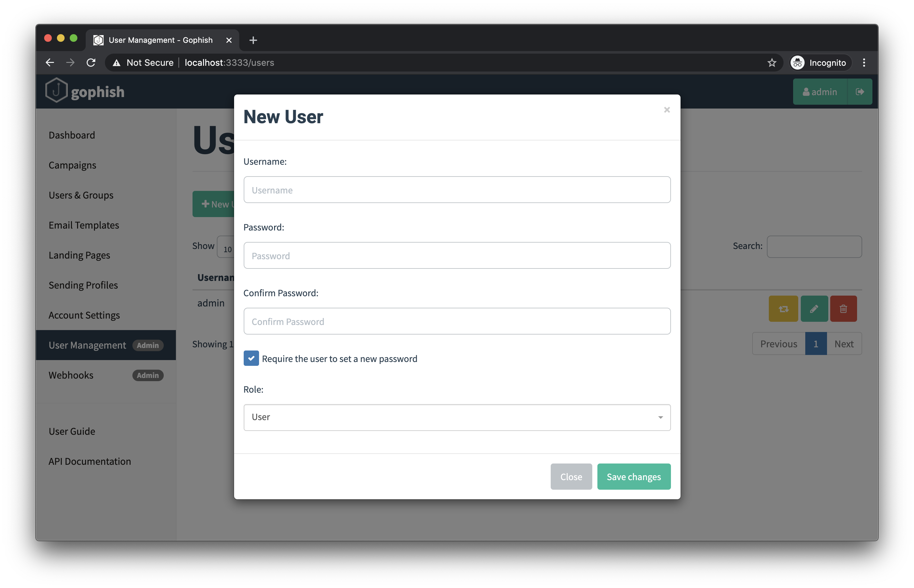

# User Management

Gophish supports user accounts with different roles. Right now, we offer two separate roles that can be assigned to users:

* **User** - This role allows the user to do anything _except_ system-level administrative tasks, such as managing users, managing webhooks, etc.
* **Admin** - This is a system-level administrative role that has full permissions to manage the Gophish installation

To register new user accounts and manage existing ones, login as an administrative user and navigate to the "User Management" page:

## Registering a New User

To register a new user, click the **"+ New User**" button, which will cause the following dialog to appear:

In this form, you can choose the username, password, role, and whether or not the user is required to reset their password when they first login.

## Delete a User

To delete a user, click the red trash can icon next to the username in the users list.


You are required to have at least one user with the "Admin" role at all times. If you try to delete the last administrative user, Gophish will return an error.


## Impersonate A User

There may be cases where a user in Gophish is running into issues and would like help troubleshooting. To support this, Gophish has the ability to let administrators "impersonate" any user.

By clicking the yellow button next to the username in the users list, you will automatically be logged into a session for the given user, and interact with Gophish on that user's behalf.

When you are ready to return to your administrative session, you will need to logout, and log back in using your administrative credentials.

