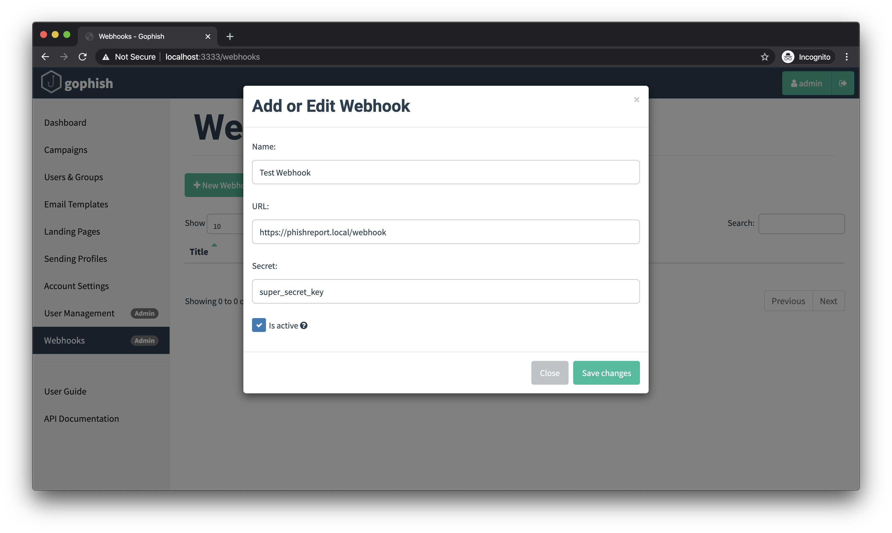

# Webhooks

Ever since Gophish was launched, we've had the ability to fetch campaign results via the API. But sometimes, you may want to have campaign updates pushed directly to you as they happen.

To solve this problem, as of v0.9.0 we've added support for webhooks.

When you configure a webhook, Gophish will make \(optionally signed\) HTTP requests to an endpoint you control. These requests include the JSON body of the event that just happened- the exact same JSON that you would normally receive via the API. This gives you real-time updates to your campaign as they happen.

Gophish supports multiple webhooks. Only users with the Admin role are able to create webhooks by navigating to the "Webhooks" sidebar entry and clicking the "New Webhook" button.



### Validating Signatures

Each webhook sent by Gophish is signed using an optional secret. This signature is computed over the entire request JSON body using the HMAC-SHA256 hashing algorithm. This is a common practiced used elsewhere by organizations like [GitHub](https://developer.github.com/webhooks/securing/), [Twitter](https://developer.twitter.com/en/docs/accounts-and-users/subscribe-account-activity/guides/securing-webhooks), [Twilio](https://www.twilio.com/docs/usage/webhooks/webhooks-security), and more.

This signature is sent in the `X-Gophish-Signature` header, which looks like this:

```text
POST /webhook HTTP/1.1
Host: localhost:9999
Accept-Encoding: gzip
Content-Length: 226
Content-Type: application/json
User-Agent: Go-http-client/1.1
X-Gophish-Signature: sha256=2be52d4b83eb7f19b0ecc75ebd6441cefea5512443eb18d38a8beb2e7584a66c
```

It's highly recommended to both set a secure secret as well as validating webhook signatures to ensure that events came from your Gophish instance.

### Event Format

Each event has the following format:

```text
{
    "email": "foo.bar@example.com",
    "time": "2020-01-20T17:33:55.553906Z",
    "message": "Email Opened",
    "details": ""
}
```

The following `message` values are supported:

| Message | Description |
| :--- | :--- |
| Error Sending Email | Gophish was unable to send the email to the recipient |
| Email Sent | The email was successfully sent to the recipient |
| Email Opened | The recipient opened the email |
| Clicked Link | The recipient clicked the link in the email |
| Submitted Data | The recipient submitted data to the landing page |
| Email Reported | The recipient [reported](email-reporting.md) the campaign email 🎉 |

The "Email Opened", "Clicked Link", and "Submitted Data" events also include the `details` field which has the following format:

```text
"payload": {
    "rid": "1234567",
    "browser": {
        "address": "127.0.0.1",
        "user-agent": "Mozilla/5.0 (Macintosh; PPC Mac OS X 10_10_4; rv:1.9.3.20) Gecko/2017-08-09 20:28:42 Firefox/3.8",
    },
    "foo": ["bar"]
}
```

In this example, the `foo` field is data that was submitted to the landing page. Each form element will have its own key and list of values which will depend on the format of your landing page.

### Example Server

For an example on how to receive, validate, and parse webhook messages from Gophish, we've open-sourced an [example server](https://github.com/gophish/webhook) you can find [on GitHub](https://github.com/gophish/webhook). However, since we follow the same common signing pattern used by other webhook providers, most libraries should work with Gophish as well.

